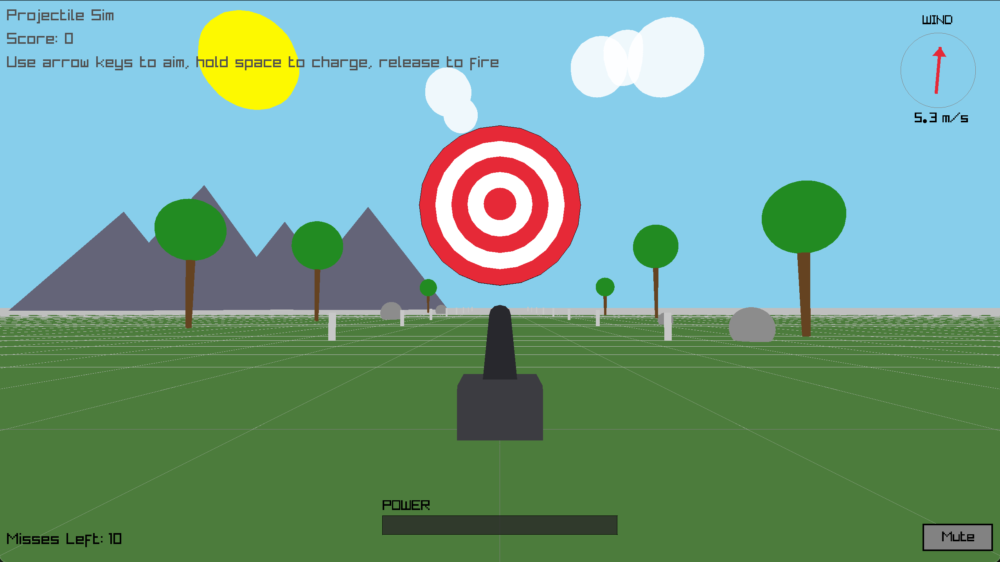

# Projectile Simulator



## How to install

Pick the section for your operating system. The same `make` command builds the game on MacOS and Windows.

### macOS

These steps use [Homebrew](https://brew.sh), a package manager for macOS. If you don't already have it, install it by pasting this into your terminal and following the prompts:

```/bin/bash -c "$(curl -fsSL https://raw.githubusercontent.com/Homebrew/install/HEAD/install.sh)"```

**1. Get the code.** If you don't have git, install it first with `brew install git`. Then download the code and move into the project folder:

```
git clone https://github.com/ehochw01/Projectile-Sim.git
cd Projectile-Sim
```

**2. Install raylib:**

```brew install raylib```

**3. Compile and run:**

```make && ./sim```

That's it — Ready to Play! 🎉

> **Linux:** the Makefile builds on Linux too — install raylib via your package manager (e.g. `sudo apt install libraylib-dev`), then `make && ./sim`.

### Windows

The easiest setup on Windows is [w64devkit](https://github.com/skeeto/w64devkit/releases), which bundles `g++`, `make`, and git in one download.

**1. Install w64devkit.** Download the latest release, unzip it, and run `w64devkit.exe` to open its terminal. Run all the commands below inside that terminal.

**2. Get the code:**

```
git clone https://github.com/ehochw01/Projectile-Sim.git
cd Projectile-Sim
```

**3. Install raylib.** Download the raylib Windows release from the [raylib releases page](https://github.com/raysan5/raylib/releases) (pick the `mingw-w64` build) and unzip it, for example to `C:\raylib\raylib`.

**4. Compile and run.** The Makefile expects raylib at `C:/raylib/raylib`. If you put it there, just run:

```make && sim.exe```

If you unzipped it somewhere else, point the build at it:

```make RAYLIB_PATH=C:/your/path/to/raylib && sim.exe```

That's it — Ready to Play! 🎉

## How to play

Use your computer arrow keys (UP, DOWN, LEFT, RIGHT) to change the aim direction of the cannon.

Hold the space bar to begin firing the cannon. The longer you hold the space bar, the more powerful the shot will be. Release the space bar to fire.

Aim for the bullseye targets on the screen. Each target is a set of concentric rings, and the more centered your hit, the more points you score: the outer ring is worth 1 point, climbing up to 5 points for a dead-center bullseye. After being struck, a target briefly disappears before reappearing at a new spot, and every 3rd hit, it also shrinks and changes color, making it progressively harder to hit.

**Combo multiplier:** consecutive hits (without a miss in between) multiply your score. A "+N" popup appears at the hit location showing the exact points awarded.

**Difficulty tiers:** as your hit count climbs, targets begin patrolling side-to-side (tier 1), then move faster (tier 2), then switch to a circular Y-Z arc (tier 3). The current tier badge is shown in the top-right corner of the screen.

You start with 10 misses (shown as colored squares at the bottom-left). A shot counts as a miss if it sails past the target or is too weak to ever reach it. When you run out of misses, the game ends and a Game Over screen displays your final score. Press **R** to restart.

Make sure to consider wind when aiming your shot. The wind compass (top-right) shows direction and speed; wind changes every 3rd hit, and the compass flashes "WIND!" as a warning one hit before the change.

## Live reload during development

> **Note:** `make watch` is macOS/Linux only, since it relies on `entr` and a Unix shell. On Windows, just rerun `make` manually after each change.

To automatically rebuild and rerun the simulation every time you save a source or header file, use the `watch` target.

First install [entr](https://eradman.com/entrproject/) (a lightweight file watcher):

```brew install entr```

Then run:

```make watch```

This watches all files in `src/` and `include/`. Whenever you save a change, the running sim closes, only the changed files recompile, and the sim relaunches. Press `Ctrl-C` to stop watching.

Notes:
- If a build fails, the old sim won't relaunch. The compiler error shows in the terminal and the watcher keeps waiting for your next save.
- If you *add* a brand-new source file, restart `make watch` so it picks up the new file (and remember to add it to `SRCS` in the Makefile).

## Folder structure

```
include/   header files (.h)
src/       implementation files (.cpp)
images/    start screen texture
music/     background music (8bit_music.mp3)
Makefile
README.md
```

Headers live in `include/` and are compiled with the `-Iinclude` flag, so source files include them by bare filename (e.g. `#include "Cannon.h"`) without needing a relative path.

## Inheritance structure of classes

The root class is `Entity`, which has a position, a `virtual` destructor, a `virtual` `Update(float dt)` method, and a `virtual` `Draw()` method.

`PhysicsBody` inherits from `Entity` and implements `Update()` with gravity, wind resistance, and bounce mechanics. Entities that move under physics inherit from `PhysicsBody`. Wind is randomly generated and changes every three hits.

`Projectile` inherits from `PhysicsBody` and implements `Draw()` as a sphere via raylib's `DrawSphere()`. It also owns the wind state shared across the session (`GenerateWind()`).

`Debris` also inherits from `PhysicsBody`, reusing all the same gravity and bounce logic for free. Debris are the colored fragments that erupt from a target when it is struck (100 pieces per hit, capped at 300 total alive at once).

`Target` inherits directly from `Entity` (it does not need physics). It is drawn as a bullseye of concentric vertical rings facing the cannon via `DrawCylinderEx()`. Key methods:
- `CheckHit()` — tests whether the ball crossed the disk's plane within the disk face on a given frame (fires exactly once per pass-through). Returns 0 for miss, 1–5 for ring struck.
- `Missed()` — returns true once the ball can no longer score: either it flew past the target's plane, or it fell short and is no longer moving toward it.
- `ApplyDifficulty(tier)` — sets patrol speed and arc mode from the current difficulty tier. At tier 0 targets are stationary; at tier 1+ they patrol side-to-side; at tier 3 they move in a circular Y-Z arc.

`Cannon` does **not** inherit from `Entity` — it is not subject to gravity or wind. Only user input moves it (azimuth, elevation, launch speed). `Fire()` takes a `Projectile` by reference and sets its velocity. `Update()` drives a spring-damper recoil animation and muzzle flash. `Reset()` restores launch speed and clears recoil.

`main.cpp` contains the game loop and several free functions:
- `DrawWorld()` — renders the 3-D environment (ground, grid, range markers, trees with rustling leaves, boulders, mountains, clouds, sun/moon/stars). Environment appearance adapts to a randomly chosen time-of-day: **DAY**, **SUNSET**, or **NIGHT** (new value each session/restart).
- `DrawWindHUD()` — renders the wind compass (direction arrow + speed in m/s) in the top-right corner. Flashes "WIND!" one hit before the wind changes.
- `DrawPowerBar()` — renders the charge bar at the bottom-center while the player holds SPACE.
- `GenBoom()` / `GenHit()` — procedurally synthesize the cannon-fire and target-hit sound effects at startup (no audio files needed for SFX). Looping 8-bit background music is loaded from `music/8bit_music.mp3`. A **Mute/Unmute** button sits in the bottom-right corner.

Visual effects in the game loop: a **ball trail** (12-frame ghost spheres), **muzzle smoke particles** on fire, **camera shake** on fire and on hit, a **hit flash** on the target face, and a **"+N" score popup** that appears at the target position after each hit.

